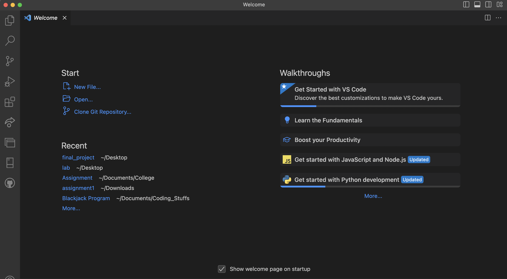
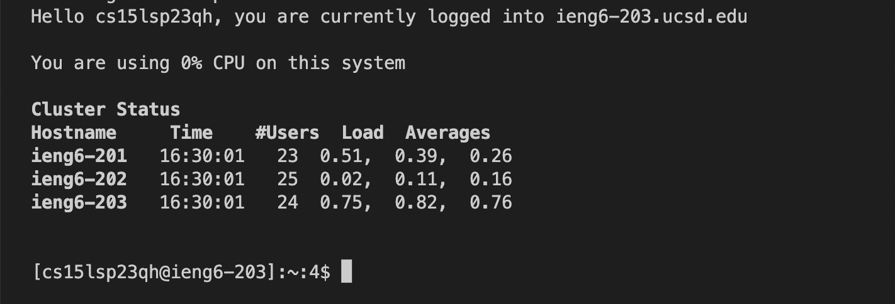

# Lab Report 1  

## Below we will be going over how to log into a course specific account on ieng6!  

Steps:  
- Installing VSCode
- Remotely Connecting
- Trying Commands

## Installing VSCode
1. Navigate to https://code.visualstudio.com/ and download the VSCode specific to your operating system.  
2. After downloading VSCode and opening it, it should look like the image below.  

  

Wonderful! You've successfully installed and opened VSCode.

## Remotely Connecting
1. Now open up a new terminal in VSCode.  
2. In the terminal paste this command: ssh cs15lsp23qh@ieng6.ucsd.edu  
3. After pasting this command you will be prompted to enter a password where you will enter the password you have set for the account.    
If all was done successfully you should see the below image in your terminal:  
  

## Trying Commands
1. After you have successfully completed the above step, you can start running commands in the terminal.   
Examples of Commands:  
- cd ~
- cd
- ls -lat
- ls -a
- cp /home/linux/ieng6/cs15lsp23/public/hello.txt ~/
- cat /home/linux/ieng6/cs15lsp23/public/hello.txt
Here is an example output after running some commands:  

